# SQL-Gadgetsales

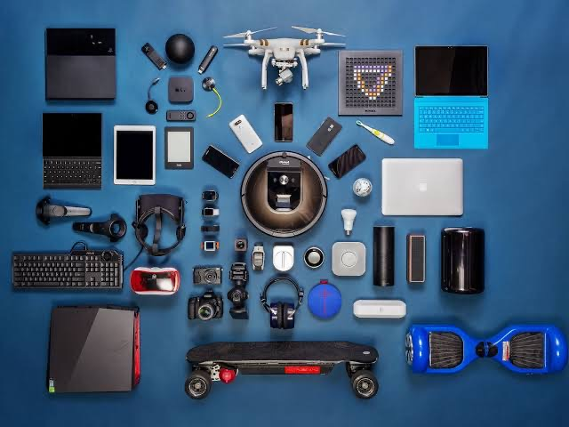
----

## Introduction
Mr. Chinedu has a shop where he sells different kinds of gadgets. As a data analyst, I have been granted access to the database file, 'GadgetSales.sql' which contains vital information, with my analysis I have helped to answer crucial questions and concerns about his business.

## Data Source
This Data was gotten from the GadgetSales Database.

## Problem Questions
1. Which device had the most sales by quantity?
2. Which device had the lowest sales by quantity?
3. Top 3 most expensive gadgets.
4. Top 3 customer names that spent the most.
5. Which order date did the least quantity of gadget sold?
6. Which customer name had the most orders by quantity?
7. List 3 devices with the lowest sales by quantity.
8. On which order date did “iPad Pro” had the most sales by quantity?
9. Which customer name bought “iPhone 13” the most by quantity?
10. Between the cheapest device and the most expensive device, which had more quantity 
sold? And why is the result so?

## Answers
1.	Pro HERO 10 Black was the device with the most sales with 1070 units sold.
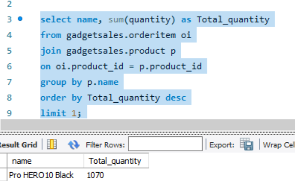

2.	Logitech MX Master 3 was the device with the least sales with 95 units sold.
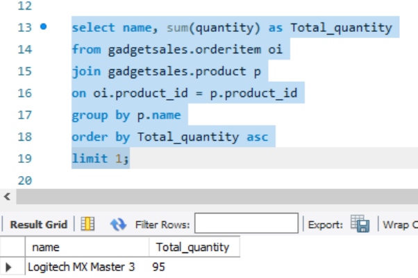

3.	Canon EOS R6, Sony Alpha a7 III and LG OLED C1 Series are the top 3 most expensive device.
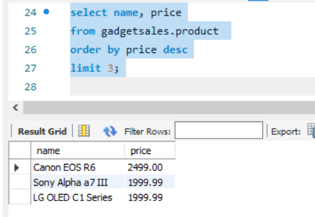

4.	Megan Smith, Andrew Chen and Tommy Baker are the top 3 customers that spent the most with each spending $744,965.26, $654,973.81 and $627,492.94 respectively.
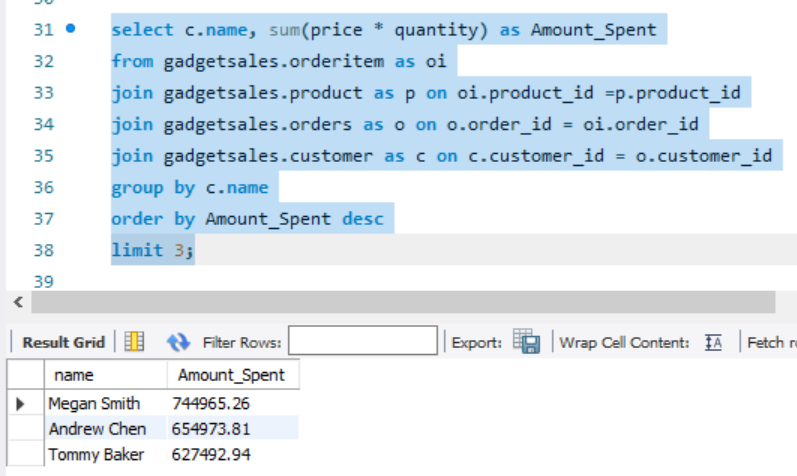

5.	12th February, 2022 was the date with the least number of orders with only 16 gadgets sold.
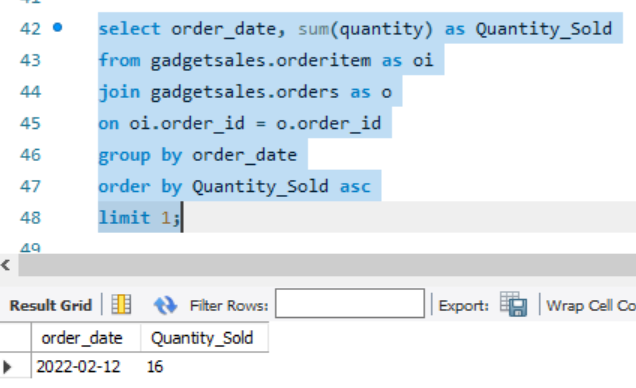

6.	Megan Smith ordered the most quantity of devices, with 694 gadgets ordered.
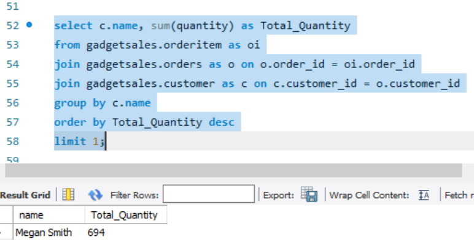

7.	Logitech MX Master 3, Garmin Venu 2 and LG OLED C1 Series were the devices with the least sales with 95, 122, and 280 unit sold respectively.

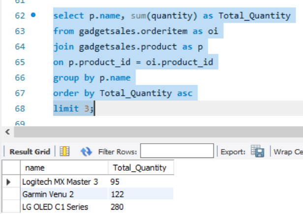

8.	iPad Pro had its most sales on the 24th July, 2022 with 50 units sold.
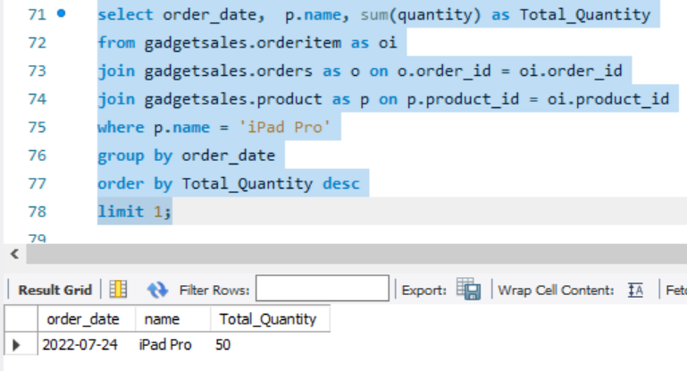

9.	Noah Kim purchased the most quantity of iPhone 13, he purchased 80 units.
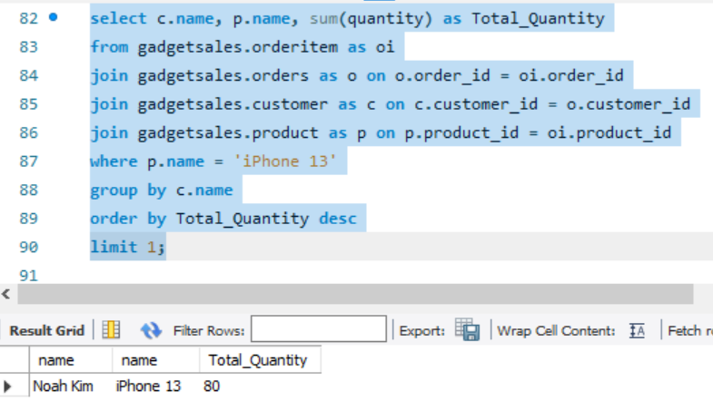

10.	Amazon Echo Dot (4th Gen) was the cheapest device with 365 units sold while Canon EOS R6, the most expensive device with 936 units sold. Canon EOS R6 sold more quantity despite its high price, this is because of its features and the great result it produces when used.

Cheapest Device    | Most Expensive Device
:-----------------:|:---------------------:
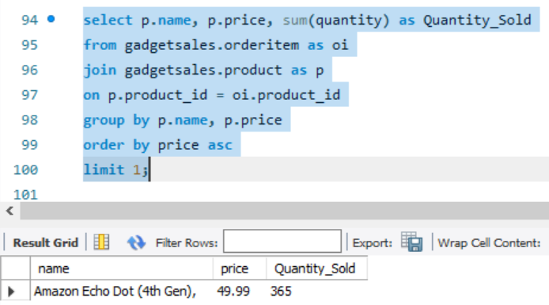      |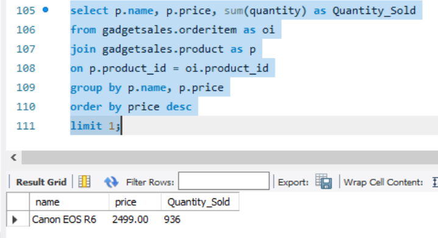
----

## Conclusion
From the analysis above, Mr Chinedu’s questions and concerns were answered, these findings will help him focus more on restocking devices with the most quantity ordered and properly manage sales in his business.
